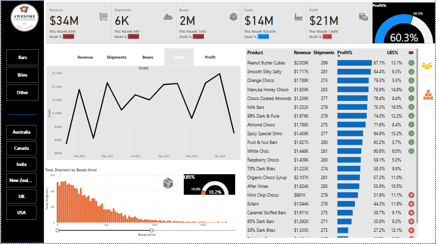
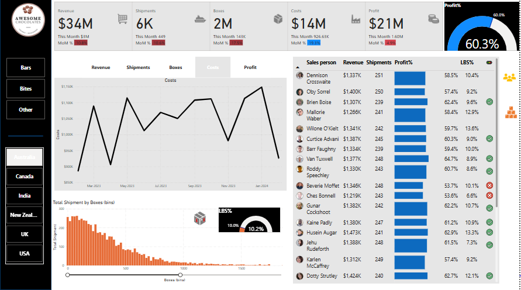
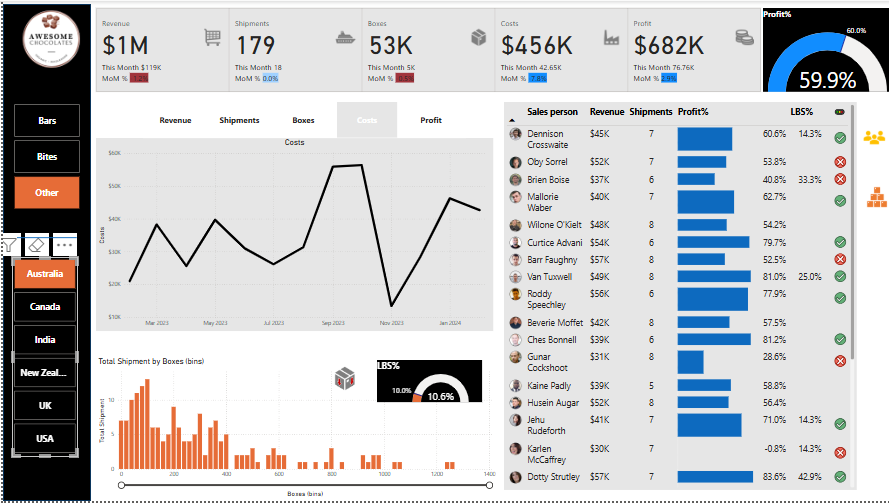

# Awesome Chocolates Sales Dashboard

This project features a Power BI dashboard developed to visualize key business metrics for Awesome Chocolates, including revenue, shipments, costs, and profit. The dashboard provides insights into product performance, shipment trends, and profitability.

## Dashboard Features
- **Key Metrics:** Displays monthly revenue, shipment, cost, and profit data.
- **Visualizations:** Includes charts for revenue, shipments, and costs.
- **Product Analysis:** Highlights top-performing products and profit margins.
- **Geographic Insights:** Filters data by countries and product types.

## Dashboard Preview
Here are some snapshots of the dashboard in action:

### Snapshot 1


### Snapshot 2


### Snapshot 3


## How to Use
1. Clone the repository:
   ```bash
   git clone <https://github.com/lamakye7/chocolate_sales_dashboard/tree/main>
   ```
2. Open the Power BI file in Power BI Desktop.
3. Update the data source paths if needed.

## YouTube Tutorial Reference
This dashboard was developed by following [this YouTube tutorial](https://youtu.be/ooJO7NW4uJU?si=BT5LVhBe88Y2jVHx). Special thanks to the content creator for their clear instructions and valuable insights.

## Tools and Technologies Used
- Power BI Desktop
- Data modeling and visualization techniques

## License
This project is licensed under the MIT License. See the LICENSE file for more information.

## Contact
For questions or feedback, please feel free to reach out @ louisamakye20@gmail.com

